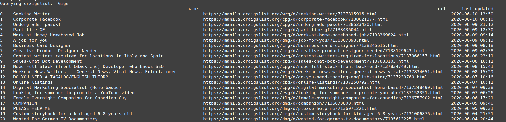
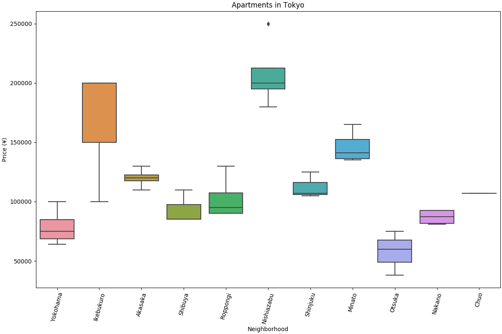

# Mining craiglist

I thought about scraping data from craigslist. So just for fun, I created [craigslist-cli](github.com/jpdeleon/craigslist-cli).
This library includes a set of convenience scripts that scrapes relevant information in various craigslist websites.

For example, you can get a summary of posts about gigs, jobs, etc. in a specific location on your terminal:

```bash
./posts.py -g -l manila -v 
```


You can also get information about apartments in Tokyo by showing your a boxplot of prices per neighborhood:
```bash
./apartments.py -l tokyo -n 1 -b -v 
```
 

Try it out and let me know if it works out for you! I am open for pull requests. :)
